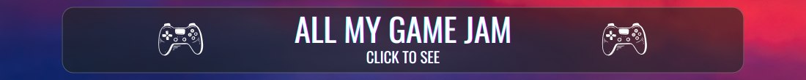
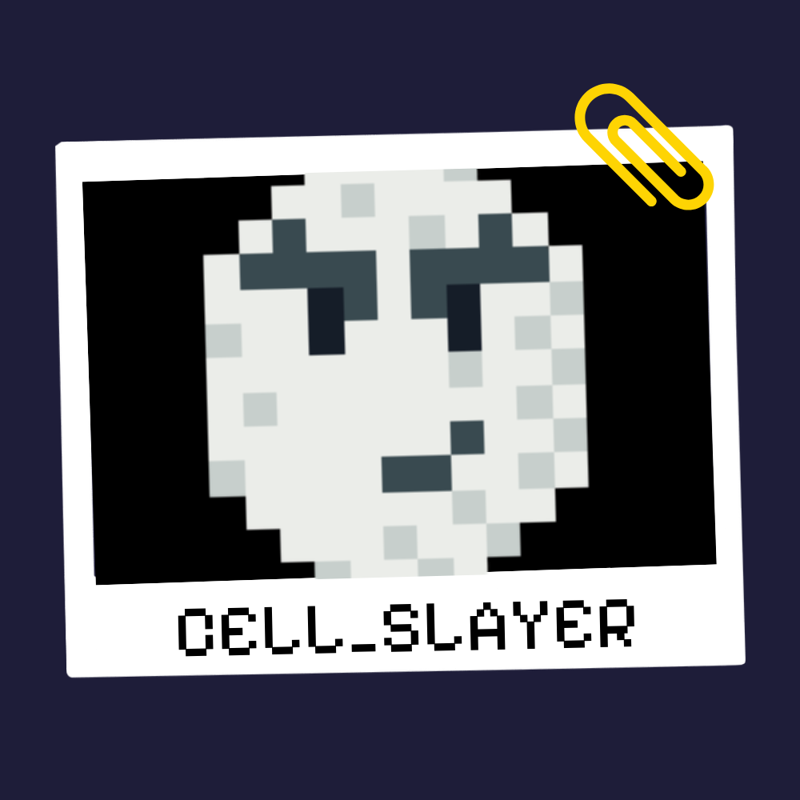
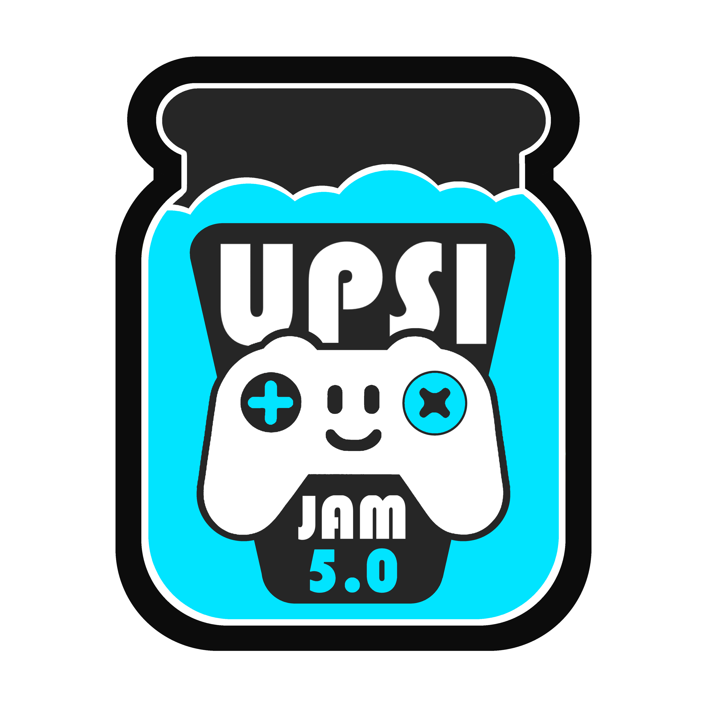

<table style="table-layout: fixed; width: 100%;">
  <!-- Rangée 1 : Image Banner sur 4 colonnes -->
  <tr>
    <td colspan="4" align="center">
      
    </td>
  </tr>
  <!-- Rangée 2 : 4 cellules de même taille -->
  <tr>
    <!-- 1ère cellule : image/logo.png cliquable, 100x100 -->
    <td style="width: 25%;" align="center">
      
    </td>
    <!-- 2ème cellule : image/upsi.png cliquable, 100x100 -->
    <td style="width: 25%;" align="center">
      
    </td>
    <!-- 3ème cellule : texte avec les détails du jeu -->
    <td style="width: 25%;" align="left">
      <strong>Theme:</strong> Split 
      <strong>Game:</strong> Cell_Slayer 
      <strong>Started:</strong> 14-03-25 
      <strong>Ended:</strong> 16-03-25, 
      <a href="https://magillie.itch.io/cell-slayer">Click for play</a>
    </td>
    <!-- 4ème cellule : auteurs avec liens GitHub -->
    <td style="width: 25%;" align="left">
      <strong>Authors:</strong> 
      <a href="https://github.com/lnicolosi">Luca Nicolosi</a> 
      <a href="https://github.com/Crealex">Alexandre Tomasi</a> 
      <a href="https://github.com/Gregos622">Gregory Koller</a> 
      <a href="https://github.com/MatthieuGillieron">Matthieu Gillieron</a>
    </td>
  </tr>
</table>
