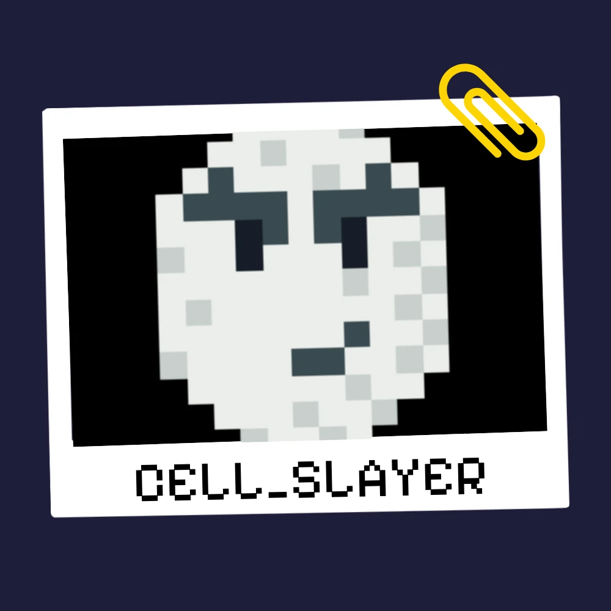
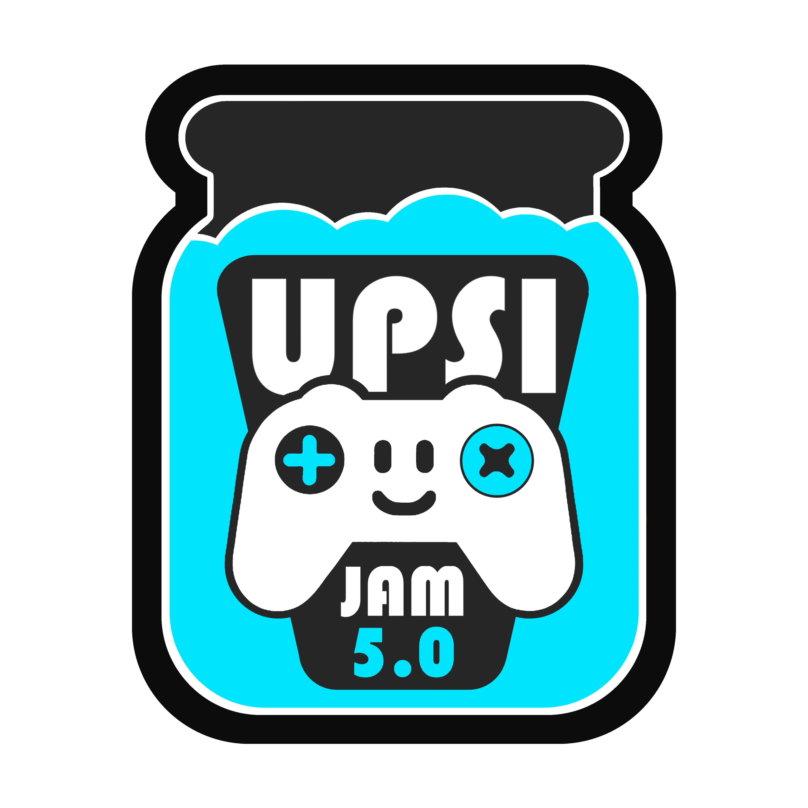

<h1 align="left">Game Jam</h1>

This repository gathers every game jam I've taken part in, each card links to its dedicated repo below.

 

<table style="table-layout: fixed; width: 100%;">
  <!-- Rangée 2 : 4 cellules de même taille -->
  <tr>
    <!-- 1ère cellule : image/logo.webp cliquable, 100x100 -->
    <td style="width: 25%;" align="center">
      
    </td>
    <!-- 2ème cellule : image/upsi.webp cliquable, 100x100 -->
    <td style="width: 25%;" align="center">
      
    </td>
    <!-- 3ème cellule : détails + description + liens -->
    <td style="width: 50%;" align="left">
      <strong>Theme:</strong> Split 
      <strong>Game:</strong> Cell_Slayer 
      <strong>Description:</strong> A survival game in the style of Brotato, developed in Godot with a team of 4. 
      <a href="https://magillie.itch.io/cell-slayer">Click to play</a> | <a href="https://github.com/MatthieuGillieron/cell_slayer.git">See the repo</a>
    </td>
  </tr>
</table>
